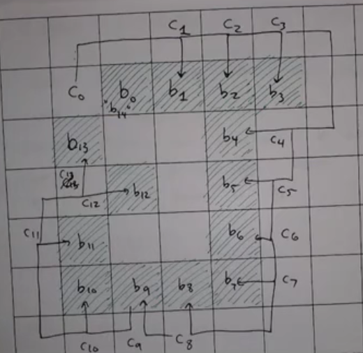
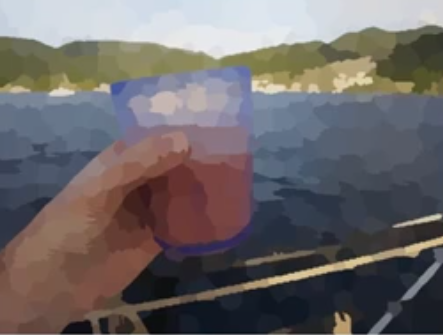
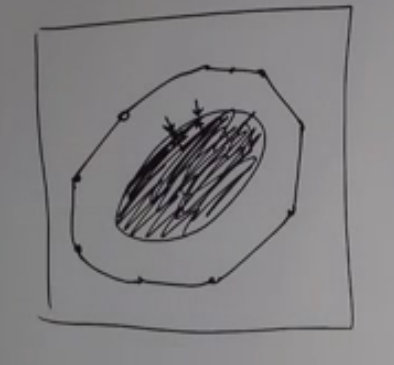
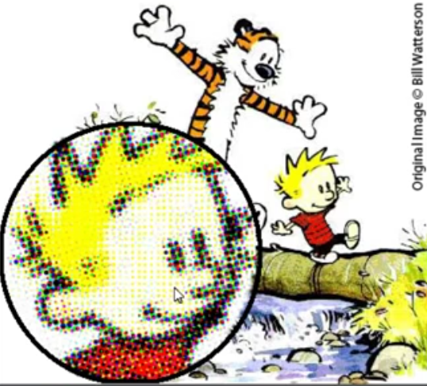

[Lesson URL](https://www.bilibili.com/video/BV137411H74f?p=1)

# Digital Image Processing
## Lecture 4  Histograms and Point Operations  


> There introduces point operations, which affect every pixel with the same grayscale value the same way. Could be regarded as global operations.

### 1. Histogram Stretching
$$
F(D)=\frac{255}{H-L}(D-L)
$$

### *2. Histogram Equalization*
I could say that histogram equalization could be summarized that first map the previous grayscale value to the interval[0, 1] in terms of their cumulative probability, then stretch them into interval[0, 255].

### 3. Gamma Correction
Every display device has a different nonlinear relationship between pixel input intensity and display output luminance. 
$$
V_{\text {out }}=A V_{\text {in }}^{\gamma}
$$
where A is a scalar coefficient, $ \gamma $ < 1 called encoding gamma, while $ \gamma$ > 1 called decoding gamma.

## *Lecture 5  Geometric Operations*  
> *First introduce the frequently-used transformations, including affine transformation, rigid transformation, and their contains. Then there comes  projection transformation, which could be frequently used in image stitching.*

### *1. Basic Operations*
#### 1) Translation 
$$
J\left( x,y \right) =I\left( x+m,y+n \right)
$$
where $J(x, y)$ refers to the pixel value of translated image, $I(x, y)$ refers to pixel value of original image.  This operation translates the original image left by m pixels, down by n pixels. Could be represented as :
$$
\left[ \begin{array}{c}
	x'\\
	y'\\
\end{array} \right] =\left[ \begin{matrix}
	1&		0\\
	0&		1\\
\end{matrix} \right] \left[ \begin{array}{c}
	x\\
	y\\
\end{array} \right] +\left[ \begin{array}{c}
	m\\
	n\\
\end{array} \right]
$$

#### 2) Scaling
$$
J\left( x,y \right) =I\left( m\cdot x,n\cdot y \right)
$$
which means the image is zoomed in m times in x-direction, n times in y-direction.  Could be represented as :
$$
\left[ \begin{array}{c}
	x'\\
	y'\\
\end{array} \right] =\left[ \begin{matrix}
	m&		0\\
	0&		n\\
\end{matrix} \right] \left[ \begin{array}{c}
	x\\
	y\\
\end{array} \right]
$$

#### 3) Flip
$$
J\left( x,y \right) =I\left( -x,-y \right)
$$
Could be represented as :
$$
\left[ \begin{array}{c}
	x'\\
	y'\\
\end{array} \right] =\left[ \begin{matrix}
	-1&		0\\
	0&		-1\\
\end{matrix} \right] \left[ \begin{array}{c}
	x\\
	y\\
\end{array} \right]
$$

#### 4) Rotation
We have a screenshot of the interpretation of rotation in the video here, which offers straightforward understanding.


$$
\left[ \begin{array}{c}
	x'\\
	y'\\
\end{array} \right] =\left[ \begin{matrix}
	\cos \theta&		-\sin \theta\\
	\sin \theta&		\cos \theta\\
\end{matrix} \right] \left[ \begin{array}{c}
	x\\
	y\\
\end{array} \right]
$$

#### 5) Shearing
Remain one coordinate invariant and change the other coordinate using the former coordinate. A reasonable example is as follows :
$$
\left[ \begin{array}{c}
	x'\\
	y'\\
\end{array} \right] =\left[ \begin{matrix}
	1&		b\\
	0&		1\\
\end{matrix} \right] \left[ \begin{array}{c}
	x\\
	y\\
\end{array} \right] 
$$


### *2. Rigid Transformation* 
If the distance between two points in original image remains the same after being transformed, it is called rigid transformation, which contains translation, rotation and flip.

### *3. Affine Transformation* 
If lines in the original image remain parallel after transformation, it could be called affine transformation, which contains translation, rotation, flip, shearing and scaling.

### *4. Projection Transformation* 
Could be represented as :
$$
\left[ \begin{array}{c}
	\tilde{x}'\\
	\tilde{y}'\\
	\tilde{z}'\\
\end{array} \right] =\left[ \begin{matrix}
	a_{11}&		a_{12}&		b_1\\
	a_{21}&		a_{22}&		b_2\\
	c_1&		c_2&		1\\
\end{matrix} \right] \left[ \begin{array}{c}
	\begin{array}{c}
	x\\
	y\\
\end{array}\\
	1\\
\end{array} \right] 
\\
x'=\frac{\tilde{x}'}{\tilde{z}'}
\\
y'=\frac{\tilde{y}'}{\tilde{z}'}\\
$$
Without more details.

> *After that there introduce some interpolation methods.*

### *1. Nearest Neighbor Interpolation*


### *2. Linear Interpolation* 


### *3. Bilinear Interpolation* 


### *4.  Bicubic interpolation*

Bicubic interpolation uses more points to get the value of new points compared with bilinear interpolation, concretely using nearest 16 points for calculation. It quantify the influence that 16 points have to the new point, then get output.


## *Lecture 6  Spatial Filters*
> *There will be several filters, which could be represented by :* 
>
*$$J(x, y)=\sum_{s=-a}^{a} \sum_{t=-b}^{b} kernel(s, t) I(x+s, y+t)$$*

### *1. Smoothing/Low-pass Filter*

Idea is to replace each pixel by a weighted average of its neighbors. It could remove or reduce noise, but also blur the images and removes details. In other words, it reduces high-frequency signal like edges in the image.

#### *1) Mean Filter:*
$$
\frac{1}{9}\left[ \begin{matrix}
	1&		1&		1\\
	1&		1&		1\\
	1&		1&		1\\
\end{matrix} \right]
$$
#### *2) Gaussian Filter:*
We could just regard Gaussian filter as a weighted mean filter, which preserves more information about current pixel, its weights are calculated by Gaussian distribution. 

Two-dimensional Gaussian distribution : 
$$
G(x, y)=\frac{1}{2 \pi \sigma^{2}} e^{-\frac{x^{2}+y^{2}}{2 \sigma^{2}}}
$$


Theoretically, Gaussian distribution has nonpositive values on all domain of definition, yet we just need to get values which belong to $\left[ \mu -3\sigma ,\mu +3\sigma \right] $. If we set $\sigma = 1.5$, then the filter would be as:
$$
\left[ \begin{matrix}
	0.094&		0.118&		0.094\\
	0.118&		0.147&		0.118\\
	0.094&		0.118&		0.094\\
\end{matrix} \right]
$$

#### *3) Median Filter:*
Could be used to remove 'salt & pepper' noise. We set the current pixel value to be the median of pixel values that are boxed by filter.

#### *4) Others:*

If you want to emphasize pixel in the middle, filters that meet your requirement could be something as follows :
$$
\frac{1}{16}\left[ \begin{matrix}
	1&		2&		1\\
	2&		4&		2\\
	1&		2&		1\\
\end{matrix} \right]
$$

### *2. Edge-detection/High-pass Filter (Simple)*
#### 1) brief introduction
Image differencing (related to differentiation) results in sharpening.


*We could regard this as calculating first-order derivative via numerical method like $f'\left( x \right) =\frac{f\left( x+1 \right) -f\left( x \right)}{1}$, as well as second-order derivative. 

The first step in sharpening is to find a filter that reacts strongly to edges.

$\left[ \begin{matrix}
	-1&		1\\
\end{matrix} \right] $ : could get the first-order derivative, which could reflect edges.

$\left[ \begin{matrix}
	1&		-2&		1\\
\end{matrix} \right] $ : could get the second-order derivative,which shows sign changes near edges but is 0 elsewhere.

#### 2) Roberts Operator

Sensitive to diagonal direction.
$$
S_x=\left[ \begin{matrix}
	1&		0\\
	0&		-1\\
\end{matrix} \right] ,S_y=\left[ \begin{matrix}
	0&		-1\\
	1&		0\\
\end{matrix} \right]
$$

#### 3) Prewitt Operator 

Using three first-order derivative to calculate current pixel gradient.
$$
s_{x}=\left[\begin{array}{lll}-1 & 0 & 1 \\ -1 & 0 & 1 \\ -1 & 0 & 1\end{array}\right], s_{y}=\left[\begin{array}{ccc}1 & 1 & 1 \\ 0 & 0 & 0 \\ -1 & -1 & -1\end{array}\right]
$$

#### 4) Sobel Operator

Give more weights to the center gradient.
$$
s_{x}=\left[\begin{array}{ccc}-1 & 0 & 1 \\ -2 & 0 & 2 \\ -1 & 0 & 1\end{array}\right], s_{y}=\left[\begin{array}{ccc}1 & 2 & 1 \\ 0 & 0 & 0 \\ -1 & -2 & -1\end{array}\right]
$$


#### 5) Laplacian Operator

The only second-order derivative operators there.
$$
\nabla ^2F(x,y)=\frac{\partial ^2F}{\partial x^2}+\frac{\partial ^2F}{\partial y^2}
$$

where
$$
\frac{\partial ^2F}{\partial x^2}=F\left( x+1,y \right) +F\left( x-1,y \right) -2F\left( x,y \right)\\
\frac{\partial ^2F}{\partial y^2}=F\left( x,y+1 \right) +F\left( x,y-1 \right) -2F\left( x,y \right)
$$
Here we have 
$$
\nabla ^2F(x,y)=F\left( x+1,y \right) +F\left( x-1,y \right) +F\left( x,y+1 \right) +F\left( x,y-1 \right) -4F\left( x,y \right)
$$
The Laplacian filter could be as:
$$
\left[ \begin{matrix}
	0&		1&		0\\
	1&		-4&		1\\
	0&		1&		0\\
\end{matrix} \right]
$$
 We could say Laplacian filter is not sensitive to gradually-varied or smooth edges, while sensitive to sharp edges.

### *3. Enhance/Sharpening Image Filter*
Idea is to strength the edges of original image by adding a multiple of the edge map to it. However, when we enhance the image, we also enhance the noise.
$$
J\left( x,y \right) =I\left( x,y \right) -\nabla ^2I\left( x,y \right) 
$$
Filter would be as :
$$
\left[ \begin{matrix}
	0&		-1&		0\\
	-1&		5&		-1\\
	0&		-1&		0\\
\end{matrix} \right] 
$$
The downside could be that the pixel value may saturate to 255, which is certainly not satisfying.

**Un-sharp Masking** :
$$
Output=F+k\cdot \left( F-\bar{F} \right)
$$
where F denotes the original image, $\bar{F}$ denotes the low-pass image using smoothing filters, and $k$ refers to a tunable parameter.

If we set $k=0.5$ and select mean filter, then the kernel would be like:
$$
kernel=\left[ \begin{matrix}
	0&		0&		0\\
	0&		1&		0\\
	0&		0&		0\\
\end{matrix} \right] +0.5\left( \left[ \begin{matrix}
	0&		0&		0\\
	0&		1&		0\\
	0&		0&		0\\
\end{matrix} \right] -\frac{1}{9}\left[ \begin{matrix}
	1&		1&		1\\
	1&		1&		1\\
	1&		1&		1\\
\end{matrix} \right] \right) \\\\
=\left[ \begin{matrix}
	-0.055&		-0.055&		-0.055\\
	-0.055&		1.444&		-0.055\\
	-0.055&		-0.055&		-0.055\\
\end{matrix} \right]
$$

## *Lecture 7 The 2D Fourier Transform*

> *From now on, we change our perspective from time domain to frequency domain, which is a quite significant change.*

###  *Discrete Fourier Transform(DFT)*
#### 1) Generalization from 1-d signal to 2-d image
We know that  DFT for 1-dimensional signal X:
$$
X_{k}=\sum_{n=0}^{N-1} x[n] e^{-2 \pi j \frac{k n}{N}}
$$
2-dimensional DFT for image with size of $[M,N]$:
$$
F[u, v]=\sum_{x=0}^{M-1} \sum_{y=0}^{N-1} F[x, y] e^{-\left(j \frac{2 \pi u x}{M}+j \frac{2 \pi v y}{N}\right)}
$$
adjust position of elements, here we have:
$$
F[u, v]=\sum_{x=0}^{M-1}\left(\sum_{y=0}^{N-1} F[x, y] e^{-j \frac{2 \pi v y}{N}}\right) e^{-j \frac{2 \pi u x}{M}}
$$
where $F[u,v]$ in the left side denotes the pixel value of output image, $F[x,y]$ denotes the pixel value of original image. 

As with 1-d DFT, 2-d DFT is like a decomposition of an image into complex exponentials (sines and cosines).


There's an implicit assumption that images are repeated periodically in the spatial domain, in order to perform DFT.


After processing image with DFT, the pixel value of the output will be complex numbers which could reflect amplitude and phase position. The low-frequency pixels will be at four corners of the output while the high-frequency pixels will be in the center. It can be symmetric and we could use `np.fft.fftshift` in python to change the position of corner pixels and center pixels in order to have a better visualization.

before fftshift :


After fftshift :


We can learn from the frequency domain that the test image tends to have more low-frequency signal than high-frequency signal, which means less edges.

### 2) Some thinking about image convolution

[Learn image convolution via filters](https://zhuanlan.zhihu.com/p/28478034)

First of all, it is quite important to remind us of the theorem that spatial domain convolution is the same as frequency domain multiplication. Here comes the definition of convolution.

1-dimensional convolution is defined as:
$$
f(t) * g(t)=\underbrace{\int_{-\infty}^{\infty} f(\tau) g(t-\tau) d \tau}_{(f * g)(t)}
$$
So when the definition is extended to 2-d conditions, we could take the slide of kernel along the image as an analogue of 1-d convolution scenarios, which is certainly the same way to slide $g(x)$ along the signal $f(x)$ to have the multiplication of them.

So if we rotate the filter by $180\degree$ (flip X and flip Y) , then slides along the image and multiplies with pixels, it means we are calculating spatial domain convolutions. 

Then we transform our perspective to frequency domains. We take mean filter as an example, use DFT to transform the filter into frequency domain, then we get :


We could see that the mean filter is actually a low-pass filter, whose frequency domain is all across the plane instead of $(3，3)$. The size of the kernel decides the size of the significant spatial domain. **(Not sure)**The smaller the kernel is, the bigger the size will be, which means less high-frequency information will be threw off.

So if we use mean filter to process the image, what we really do is to multiply the frequency domain of the filter with that of the image, which could remain more low-frequency signals, resulting in smoothing the image.

 Because many filters are symmetric, we omit the rotation most times, or we could just regard our filter as the rotated original filter .

#### 3) Properties
If an image has strong image edges at $\theta$ degrees, we see a strong contribution in the 2D-DFT at $\theta + 90^{\degree}$.(after `np.fft.fftshift`)


Which we could explain as follows:

Original image:
$$
\left[ \begin{array}{c}
	1\\
	1\\
	1\\
	1\\
	1\\
\end{array} \right] \left[ \begin{matrix}
	255&		0&		255&		0&		255\\
\end{matrix} \right]
$$
After DFT(not exact):
$$
\left[ \begin{array}{c}
	0\\
	0\\
	1\\
	0\\
	0\\
\end{array} \right] \left[ \begin{matrix}
	0&		1&		0&		1&		0\\
\end{matrix} \right] =\left[ \begin{matrix}
	0&		0&		0&		0&		0\\
	0&		0&		0&		0&		0\\
	0&		1&		0&		1&		0\\
	0&		0&		0&		0&		0\\
	0&		0&		0&		0&		0\\
\end{matrix} \right] 
$$
where pixels in the center are low-frequency, in the corners are high-frequency. So we could see a horizontal light bar in the middle.

## Lecture 8 Fourier Domain Filtering; Aliasing
### 1. Fourier domain filtering

#### 1) Introduction

Use a mask to preserve the middle part of the frequency domain, and throw away the rest. Mask could be of any shape.

However, phenomenon called *Ringing* happens when filtering in the frequency domain, which would introduce noise to the new image. Because high-frequency signals could also compensate low-frequency signals significantly to have better image visualization, as the image could be seen as a combination of signals, which is everywhere not just in a certain area. So if we throw off the high-frequency, then low-frequency signals tend to show their periodical property in the output image.


#### 2) How to remove Ringing?
Therefore, to avoid Ringing, we often prefer simple spatial-domain filters. Mask referred to before has step change in the frequency domain, while spatial-domain filters like Mean, has more smooth changes in the frequency domain.

 So we could mimic the spatial-domain filters to create smoothly-changed masks to have better outputs. Also, Gaussian filter is a good chioce.

Similarly we could use identity filter and low-pass filter to get High-pass filter.
$$
Highpass=\left[ \begin{matrix}
	0&		0&		0\\
	0&		1&		0\\
	0&		0&		0\\
\end{matrix} \right] -Lowpass
$$

### 2. Sampling and Aliasing
[Sampling and Aliasing](https://zhuanlan.zhihu.com/p/23923059)

To avoid aliasing, we have to sample faster than the highest frequency details in our image, but most times we could not know the exact highest frequency in our image probably due to the camera.

**Anti-Aliasing**

It's not removing aliasing from an existing image, it's blurring a digital image prior to resampling to avoid visual artifacts.  

## Lecture 9 Unitary Image Transforms

### 1. Unitary Transform

**Unitary matrix**: 
$$
A^{-1}=A^{\dagger}
$$
 where $A^{\dagger}$ denotes the conjugate transpose of $A$.

**Unitary transform**: 
$$
v[k]=\sum_{n=0}^{N-1} a[k, n] u[n]
$$
where $u$ is the input, $v$ is the output, a is the row vector of unitary matrix $A$ . If we use matrix to denote it, it could be $v=Au$ .

Then we could  get the DFT basis, we have:
$$
F[k]=\sum_{n=0}^{N-1} F[n] e^{-j \frac{2 \pi k}{N} n}
$$
So we define $A(k,n)$ as *Fourier Matrix*, then we could have the equation that 
$$
F = AF
$$
 where $F$ in the left side denotes output, right side denotes input.

Then extend it to 2-d conditions we have 
$$
F=A_M \cdot F \cdot A_N
$$
where $A_M$ is a M by M matrix, $A_N$ is a N by N matrix.

### 2. Discrete Cosine Transform (DCT)

#### 1) Introduction to DCT

We know that DFT needs a large time of Transformation. Also, if there are simply several impulse in the image, DFT will not have a satisfying output, since it needs many sines and cosines to get the impulse. Especially the condition like follows. 


For DFT:


So we attempt to replace the *Fourier Matrix* to have a better outcome. One choice is *DCT Matrix*:
$$
C(k,n)=\begin{cases}
	\frac{1}{\sqrt{N}}&		k=0\text{，}0\leqslant n\leqslant N-1\\
	\sqrt{\frac{2}{N}}\cos \frac{\pi (2n+1)k}{2n}&		\,\,k=1,...N-1 \\
\end{cases}
\
$$

$$
F=C_M\cdot F\cdot C_N
$$

$C$ is real and is a unitary matrix. $C$ has excellent energy compaction for natural images, which means packs much energy into lower coefficients, also fast transformation.

For DCT:


DCT is the critical part of the JPEG algorithm.

#### 2) JPEG Algorithm (.jpg): 

- split the input image into $8\cross 8$ blocks
- DCT of each block
- quantize DCT coefficients, which means using more fidelity or bits to save lower DCT frequencies. If the coefficient is close to zero then round down to zero, which will save space.
- code the quantized coefficients (e.g. Huffman coding)

Then if you want to open up JPEG image, it will undo this quantization and bring things back from DCT domain to spatial domain.

#### 3) Discrete Sine Transform (DST)

### 3. Hadamard and Haar Transform
#### 1) Hadamard Transform
#### 2) Haar Transform
[Haar Transform](https://blog.csdn.net/u014744118/article/details/50435542)


### 4. Wavelet Transform 

[Wavelet Transform (1)](https://zhuanlan.zhihu.com/p/22450818)

[Wavelet Transform (2)](https://zhuanlan.zhihu.com/p/44215123)

### 1) Advantages
Pros : 
- unitary
- can represent both smooth and discontinuous images without using many coefficients.
- local basis function compared with global basis function in DFT
- computationally extremely efficient, with time complexity of $O(N)$ compared with $O(N\log N)$ for DFT and DCT.
- great compression


Wavelet transform combines spatial domain and frequency domain, where time domain is represented by the location of the black-and-white squares.

### 2) JPEG 2000 (.jp2，.j2c)
Use Wavelet transform instead of DCT.

## Lecture 10 Edge Detection
### 1. Laplacian of Gaussian (LoG)

To avoid the condition like the follow, we have to smooth the image prior to edge detection, and use second-derivative.


Laplacian of Gaussian is an edge detection that can be tuned to edges at different scales. 
- Big operators tend to find large-scale/blurry edges
-  Small operators will find small-scale/fine details.

Just like Gaussian filter + Laplacian filter, which means smoothing + edge-detection at a certain scale.

Gaussian filter could be like:  $G(x, y)=e^{-\frac{x^{2}+y^{2}}{2 \sigma^{2}}}$

Then Laplacian of Gaussian :
$$
\begin{aligned}
\nabla^{2} G(x, y) &=\frac{\partial^{2}}{\partial x^{2}} G(x, y)+\frac{\partial^{2}}{2 y^{2}} G(x, y) \\
&=\left[\frac{x^{2}+y^{2}-2 \sigma^{2}}{\sigma^{4}}\right] e^{-\frac{\left(x^{2}+y^{2}\right)}{2 \sigma^{2}}}
\end{aligned}
$$


Where $\sigma$ defines the radius of the outermost circle and the height of peak. The greater $\sigma$ is, the larger the radius is and the smaller the height is.

### 2. Difference of Gaussian (DoG)
We can approximate the Log with a DoG.
$$
Dog\left( x,y \right) =\frac{1}{2\pi \sigma _{1}^{2}}e^{-\frac{\left( x^2+y^2 \right)}{2\sigma _{1}^{2}}} - \frac{1}{2\pi \sigma _{2}^{2}}e^{-\frac{\left( x^2+y^2 \right)}{2\sigma _{2}^{2}}} (\sigma_1 < \sigma_2)
$$


### 3. Canny Edge Detection: 

> Canny tends to get long thin continuous edges.

#### 1)Smoothing
**First**, smooth image with a Gaussian filter.  

#### 2)Calculating magnitude and angles
**Next**, use operators above to calculate vertical and horizontal gradient and its direction, such as Sobel. We could get $G_x$ and $G_y$.  Then,
$$
\begin{aligned}
&\mathbf{G}=\sqrt{\mathbf{G}_{x}^{2}+\mathbf{G}_{y}^{2}} \\
&\Theta=\arctan \left(\frac{\mathbf{G}_{y}}{\mathbf{G}_{x}}\right)
\end{aligned}
$$

#### 3)Non-maximum suppression
**Then**, here comes *Non-maximum suppression*. To put it simply, it refers to find the local maximum, and set other pixel values to 0, which could remove most non-edge pixels.


We could compute $dTmp1$ and $dTemp2$ using linear interpolation with respect to $g_1$, $g_2$ and $g_3$, $g_4$ respectively. If the $C<dTmp1$ or $C<dTmp2$, then set the value of center pixel C to 0; remain otherwise. This operation could make the edge be thinner, not hard to understand.

#### 4)double threshold judgement
**Finally**, *double threshold judgement* is used to suppress false edges, and to link edges. Set low threshold and high threshold. pixel whose value falls in $\left[ high,255 \right]  $is set to be strong edge pixel, while $\left[low ,high \right]  $is set to be weak edge pixel. If  weak edges are adjacent to strong ones (or could set a radius), remain the weak; otherwise delete it. Typically *high* is two/three times of *low*.

If we just use a single threshold to decide the edge, it could have a hard trade-off between false edges and gaps between edges (where high threshold tends to have more gaps while low threshold leads to more false edges). But set two thresholds can somewhat alleviate the situation.  

**The method above could be an effective way of setting thresholds.**

## Lecture 11 Edge Linking and Line Detection
### 1. Edge Linking
#### 1)Get thick edges
**First**, start with edges pixels and corresponding maps for the $M(x,y)$ and $\alpha (x,y)$, denotes magnitude and angel respectively.

Idea: For each edge pixel $(x,y)$, we make a window $S_{xy}$ around it. For each $(s,t)\in S_{xy} $ , "link" $(x,y)$ to $(s,t)$ if 
$$
\left\{ \begin{array}{c}
	\begin{aligned}
&|M(x, y)-M(s, t)| \leqslant \tau_{1} \\
&|\alpha(x, y)-\alpha(s, t)| \leqslant \tau_{2}
\end{aligned}
\end{array} \right.
$$
Could be an analogue of *Non-maximum suppression* in Canny.

#### 2)Get thin edges
**Second**, boundary following. We have edges pixels around closed contour, want to link/order them in a clockwise direction.

*Moore's boundary following algorithm:*

- Let starting point $b=b_0$ be the uppermost, leftmost point labeled "1", which denotes edge pixels. Let $c=c_0$ be the left neighbor of $b_0$ .
- Examine 8-neighbors of $b_0$, starting at $c_0$ and going clockwise. Let $b_1$ be first "1" and $c_1$ be the preceding "0". Let $b=b_1,c=c_1$.
- Repeat process of updating $b$ and $c$. Stop if $b=b_0$ and next boundary point found is $b_1$.
- The ordered list of $b$'s is the boundary.



Once we have such a boundary, we can describe it with a chain code, with the notations below:


Then we describe the edge above with the chain code, where the order depends on the starting point. 
$$
0, 0, 0, 5, 6, 6, 6, 4, 4, 4, 2, 1, 3, 1
$$
To be able to match shapes at different orientations, we can 

- Order the chain code so it always starts with the minimum-magnitude integer, means start from 0 for example above.

- Just encode the difference between directions, which is quantified by the steps needed from one to another. The chain code could be $ 0,0,5,1,0,0,6,0,0,7,2,6,7 $. The chain code will remain the same if the rotation angle falls in $[-45\degree,45\degree]$, when the starting point does not change.

#### 3)adjust to polygon
Polygonal fitting to a set of ordered points.

- Create two stacks *Final* and *In Process*. Select two endpoints called A and B, which is the leftmost and rightmost points. Initialize *Final* to contain one of the endpoint such as $\{B\}$, then initialize *In Process* to be $\{ B,A \}$. Set $T$ to be the max distance.
- Compute the line connecting the last vertices of *Final* and *In Process*.
- Compute the perpendicular distances from this line to all points between these vertices (in a counterclockwise direction just a semicircle). Select vertex $V_{max}$ with the max distance $D_{max}$.
-  If $D_{max}$ > $T$, put $V_{max}$ at the end of *In Process* and go to step 2; Otherwise remove the last vertex in *In Process* and  make it the last vertex of *Final*.
- If *In Process* is not empty, go to step 2; Otherwise DONE - the vertices in *Final* are the vertices of the polygon.

Briefly speaking, we could say that if $D_{max}$ corresponding to $V_{max}$ is larger than $T$, then there is a strong possibility that $V_{max}$ is one of the vertex of ideal polygon. So add $V_{max}$ to the vertex of polygon and find if there could be other vertices between the nearest two vertices in two sets.


### 2. The Hough Transform 
#### 1) Line Detection 

[Hough Transform](https://zhuanlan.zhihu.com/p/47649796)


We could first know that the line function could be $ax+by+c=0$, but when $a=0$ or $b=0$ or else, it could be hard to represent the slope of the line, which is $\infty$ , so we choose the polar coordinates.

Each possible line through an edge pixel can be represented as an equation:
$$
x\cos{\theta}+y\sin{\theta}=\rho
$$


So a single edge point $(x,y)$ could belong to many possible lines in the $(\rho,\theta)$ plane.

Basic Steps:

- Detect edge points $\to$ binary image

- For each edge point$(x_0,y_0)$, plot their $(\rho,\theta)$ function.

- Look for intersections of these functions to get several $(\rho,\theta)$ cells 

  combined with most functions(could get peaks by count).

- Select highlight peaks and map the corresponding $(\rho,\theta)$ into lines in the $(x,y)$ plane (or get line segments that corresponds to votes).


The basic idea is *vote*. Make $(x,y)$ be the coefficients of the function, then a single curve could represent all lines that go through $(x,y)$ . Select the peaks means to Select the lines which go through most points.

***Representation is changed:*** 
- when $(\rho,\theta)$ is determined, then the function could represents points on the line.
- When $(x_0,y_0)$ is determined, then the function could represents all lines that go through this point. 

#### 2)  Circle Detection

**Hough Transform can also detect other shapes provided the specific function is given, such as ellipse and circle.**

The function of a circle in Cartesian coordinate system could be 
$$
(x-a)^2+(y-b)^2=r^2
$$
So if we determine the point $(x_0,y_0)$, all circles that go through that point could be displayed as 
$$
(a-x_0)^2+(b-y_0)^2=r^2
$$
So we just need to plot the function in a 3-d system and look for intersections $(a,b,r)$, which is the center and radius.

We know that points could not fall on a exact circle, so we need to generalize it as something like :


Just replace it with the 3-d system would be OK. Also, it is necessary to smooth the image before circle detection.

## Lecture 12 Thresholding

### 1. Global Threshold -- OTSU's Algorithm

> Assume we use the same threshold $T$ for the whole image, then how to find the best $T$ ?

#### 1) basic ideas
The idea is to maximize between-class variance. A good threshold should separate pixels into tight clusters.

$$
\begin{aligned}&C_{1}=\{(x, y) \mid I(x, y) \leqslant k\} \quad
&C_{2}=\{(x, y) \mid I(x, y)>k\}
\end{aligned}
$$
The possibility of two clusters :
$$
P_{1}=\sum_{i=0}^{k} p_{i} \quad P_{2}=\sum_{i=k+1}^{L-1} p_{i}
$$
Where $p_i$ is the possibility of pixels with intensity $i$​, namely the frequency using *MLE*.

Global mean/variance :
$$
m_{G}=\sum_{i=0}^{l-1} i p_{i} \quad \sigma_{G}^{2}=\sum_{i=0}^{L-1}\left(i-m_{G}\right)^{2} p_{i}
$$
Class-conditional mean :
$$
m_{1}=\frac{\sum_{i=0}^{k} i p_{i}}{P_{1}} \quad m_{2}=\frac{\sum_{i=k+1}^{L-1} i p_{i}}{P_{2}}
$$
Between-class variance :
$$
\sigma_{B}^{2}=P_{1}\left(m_{1}-m_{G}\right)^{2}+P_{2}\left(m_{2}-m_{G}\right)
$$
*We select a threshold $T$ that maximize the between-class variance $\sigma_{B}^{2}$ . The ratio of $\sigma_{B}^{2}/\sigma_{G}^{2}$ serves as a good measurement of separability. Higher is better (more separable).*

#### 2) Generalization
In general, we can extend this to select ($k-1)$ thresholds to separate $k$ classes. Just modify the between-class variance :
$$
\sigma_{B}^{2}=\sum_{k=1}^{K} P_{k}\left(m_{k}-m_{G}\right)^{2}
$$
#### 3) Weakness and Remedies 
**Weakness** :

- No strong peaks in histogram 
- Object is small with respect to background 


**Remedies** :

- perform Low-pass filter prior to OTSU
- only consider pixels near edges when computing the threshold 


### 2. Variable/Adaptive Threshold 

#### 1) Per-block Basis Algorithm

```matlab
B = blockproc(A,[m n],fun) %matlab
```

The function splits A into non-overlapping blocks with the size of (m, n) and use fun to threshold them. But inevitable block artifacts will be introduced.

This algorithm will make sense if a lot of details are contained in the image. Otherwise the primitive OTSU could be better.

#### 2) Per-pixel Basis Algorithm

At every pixel $(x,y)$, build neighborhood $S_{xy}$ and compute $\mu_{xy}$, $\sigma_{xy}$.
We can make a optional rule like : 
$$
g(x, y)= \begin{cases}1, & I(x, y)>(\mu_{x y}+2 \sigma_{x y}) \\ 0, & \text { otherwise }\end{cases}
$$
Briefly speaking, we determine the pixel in terms of its surroundings.

### 3. Thresholding in RGB 
- Threshold independently on R, G, B 

- Combine the channels, e.g. $\|I(x, y)-c\|<\tau $

- Using machine learning methods, such as *SVM* or *clustering*.

## Lecture 12-a Image Segmentation
### 1. Basic Region Growing 
If we only want a "common" region near one pixel, the algorithm will be the following :
- From input image $I(x,y)$ get a binary "seed image" $S(x,y)$ for locations of interest.

- Reduce seed connected components down to a single point(avoid seed from being adjacent to each other).

- Let new image $T(x,y)=1$ (a seed) if $I(x,y)$ satisfies some predicate/condition and 0 else. For example, $(x,y)$ is a 8-connected to seed point $(x_i,y_i)$ and $\left|I(x, y)-I\left(x_{i}, y_{i}\right)\right| \leqslant T$.

- Loop step 3 until no more pixels could be contained.

The main disadvantage is that the algorithm could be uncontrolled if a reaonable seed and threshold is not given.

### 2. Region Split and Merge
Specify a condition/rule, 1 if satisfied 0 otherwise, we could define the smallest block size. The algorithm is similar to block thresholding.


### 3. Clustering and Superpixels

#### 1) K-means

#### 2) Superpixels 

Regions of image that are contiguous and have similar intensity/color.


If we use the average value of each Region to represent that superpixel, we could get :



**Advantages** 

- More compact (thousands of superpixels could represent millions of ordinary pixels)

- "Keep things together" better for subsequent segmentation; computationally efficient  

**Idea** 

clustering 5-d vectors $[r,g,b,x,y]$, where $[r,g,b]$ is the value and $[x,y]$ is the location.

**Algorithm**

- Initialize superpixel centers by sampling $N$ locations on a regular grid in image plane. Move slightly within $3\cross 3$ neighborhood to lie on lowest gradient position (We don't want to start on an edge).

  

- For each cluster center $m_i$ , compute a distance $D$ between $m_i$ and a pixel in a neighborhood of $m_i$ (prevent superpixel being too large).  Assign pixel to cluster $i$ if its distance is smaller than that with other clusters.


- Update cluster centers like in K-means
- Repeat until convergence
- Optional : Replace colors of pixels in each cluster with average.

Then we have to determine the distance $D$:

where color distance 
$$
d_{c}=\left\|\left[\begin{array}{c}
R \\
G \\
B
\end{array}\right]_{i}-\left[\begin{array}{c}
R \\
G \\
B
\end{array}\right]_{j}\right\|_{2}
$$
spatial distance 
$$
d_{s}=\left\|\left[\begin{array}{l}
x \\
y
\end{array}\right]_{i}-\left[\begin{array}{l}
x \\
y
\end{array}\right]_{j}\right\|_{2}
$$
We know that color intensity has the different range with spatial distance, so we have to scale.
$$
D=\sqrt{\left(\frac{d_c}{c}\right)^{2}+\left(\frac{d_s}{s}\right)^{2}}
$$
where $c$ is max color distance, $s$ is max spatial distance just like the image before. However, it's hard to determine $c$ exactly, so we just take $c$ as a trade-off coefficient between $d_c$ and $d_s$. 

When $c$ is big, superpixels tend to be compact similar as an irregular circle, because they make $d_s$ small. When $c$ is small, color counts more, so superpixels tend to be thinner but enjoy more color similarity.

### 4. Graph Cut Segmentation 

> It's an algorithm to separate foreground and background, but could be computationally expensive without optimization.


A *cut* is **a set of edges** that when removed separates F and B, that must be **closed or on the edge**.

We assign a weight to each edge (both pixel-pixel and pixel-terminal) and we want to find the minimum cut, which contains the minimum sum of weights, could be represented as :
$$
min \sum_{i, j\in C} w_{i j}
$$
Between adjacent pixels (could be superpixels), weight could be like:
$$
w_{i j}=\frac{1}{distance(i, j)} e^{-\frac{1}{2 \sigma^{2}}\left\|I_{i}-I_{j}\right\|^{2}}
$$
So it brings low cost to cut dissimilar edges.

We let the user "scribble" on the image to denote some initial foreground and background pixels, which form probability distribution $F_F(color),F_B(color)$.

- Scribbled pixels are forced to stick with one terminal, e.g. $F_G$ pixels has $\omega_{iF}=\infty,\omega_{iB}=0$.

- Other pixels has $
  w_{i F}=-\lambda \log F_{B}\left(I_{i}\right),
  w_{i B}=-\lambda \log F_{F}\left(I_{i}\right)
  $, means low probability tend to have high weight.

## Lecture 12-b Snakes, Active Contours and Level Set

### 1. Snakes (Active Contours)

> A segmentation algorithm using curves instead of pixels. 

#### 1) Introduction

We want a segmentation curve that

- conforms to image edges 

- is a smoothly varying curve instead of lots of jagged nooks and crannies 

Snakes are parametric representation of a curve, represented as :

$$
\left[\begin{array}{l}
x(s) \\
y(s)
\end{array}\right] \quad s \in[0,1]
$$

It means that if we change $s$ smoothly, it traces out a closed contour in the plane. For example, the following representation could get a circular contour.
$$
\left[\begin{array}{c}
x(s) \\
y(s)
\end{array}\right]=\left[\begin{array}{c}
r \cos (2 \pi s) \\
r \sin (2 \pi s)
\end{array}\right] \quad s \in [0,1]
$$

#### 2）Energy

We want to define an energy function $E(c)$, which matches our intuition about what makes a good segmentation, where $c$ is the snake curve. **Curve will iteratively evolve to reduce/minimize $E(c)$.**
$$
E(c)=E_{\text {internal}}(c)+E_{\text {external} }(c)
$$
where $E_{\text {internal}}(c)$ only depends on the shape of the curve, and $E_{\text {external} }(c)$ depends on the image intensity.

$$
E_{\text{internal}}(c)=\int_{0}^{1} \alpha\left\|c^{\prime}(s)\right\|^{2}+\beta\left\|c^{\prime \prime}(s)\right\|^{2} d s
$$
where $\alpha$ and $\beta$ control the internal energy function's sensitivity to the amount of stretch in  the snake and the amount of curvature in the snake, respectively.

When the snake is too thin, $\left\|c^{\prime}(s)\right\|^{2}$ could be large. A low absolute value of $c^{\prime \prime}(s)$ means the smooth change of first-order derivatives, which keeps figure from oscillation.


We can say that $E_{\text internal}(c)$ determines the shape of snake.
$$
E_{\text{external}}(c)=\int_{0}^{1} -\left \| \bigtriangledown I(c(s))  \right \| ^2ds\\
= \int_0^1-\left[\left(\frac{\partial I}{\partial x}(x(s),y(s))\right)^2 +\left(\frac{\partial I}{\partial y}(x(s),y(s))\right)^2   \right]ds
$$
The intuition is that 
$$
No\ Edge \Rightarrow \left\| \bigtriangledown I\right\| =0 \Rightarrow E_{\text{external}}(c)=0\\
Big\ Edge \Rightarrow \left\| \bigtriangledown I\right\|\ is\ big \Rightarrow E_{\text{external}}(c)\ is\ big\ negative\\
$$
So the snake will be attracted to edges, $E_{\text external}(c)$ determines where the snake should go.

To get the expected snake, we must have a trade-off between internal and external energy by adjusting the coefficients. **High weight of internal energy helps us to get a more satisfactorily-shaped snake, while high weight of external energy could get snake closed to edges.**

#### 3) How to minimize $E(c)$?

Requires : Variational Calculus

In practice, for digital images, we solve the problem by creating a curve $C(s,t)$, where $s$ and $t$ are both discrete, $s$ denotes the number of points on snake and $t$ denotes the iteration.


Then we step $C(s,t-1)$ to $C(s,t)$ by taking a step along gradient of the energy $E:\frac{\partial E}{\partial C}$.

Result : Curve inches along until points around boundary stop changing.

Lots of bookkeeping behind the scenes. Like, before each iteration, make the points on snake to be equally spaced, or add some points in regions that found had high curvature to force the curve to go further in.

Take an example,



When the snake is in the flat place where gradients are zero, the external energy has nothing to do, only the internal energy makes sense. It forces snake to contract until a minimum of internal energy. If at last it rushes into the region where gradients are not zero, then both external and internal will work to have a trade-off; Otherwise, the snake will have a best shape of lowest internal energy yet far from edges.

The problem with $E_{\text external}(c)$ is that 

- it cannot foresee the strong edges that far away
- if image noise exists, it might cause small gradients, then snake tend to hang up.

#### 4) Solution : Gradient Vector Flow (GVF)

[GVF](https://en.wikipedia.org/wiki/Gradient_vector_flow)

Instead of using exactly the image gradient, we create a new vector field over the image plane $V(x,y)$, and $e(x,y)$ is the edge map of image.
$$
V(x,y)=\left[\begin{aligned}
V_x(x,y)\\
V_y(x,y)
\end{aligned}
\right]
$$
$V$ is defined to minimize 
$$
\begin{aligned}
\iint\mu\left[\left(\frac{\partial V_{x}}{\partial x}\right)^{2}+\left(\frac{\partial V_{x}}{\partial y}\right)^{2}+\left(\frac{\partial V_{y}}{\partial x}\right)^{2}+\left(\frac{\partial V_{y}}{\partial y}\right)^{2}\right]
+\|\nabla e\|^{2}\|V-\nabla e\|^{2} d x d y
\end{aligned}
$$
where the first part guarantees the smoothness of $V$ and $\mu$ is the tuning parameter. In second part, $\left\|\nabla {e}\right\|$ is the magnitude of edge map, $\|V-\nabla e\|^{2}$ is the similarity between $V$ and $\left\|\nabla {e}\right\|$.

**Intuition** : 

- if  $\nabla e$ is big, means meeting edges, then $V$ follows edge gradient to be large faithfully;
- if  $\nabla e$ is small, means far from edges, then $V$ follows along to be as smooth as possible.
- And $\mu$ trades off  how smooth ***VS*** how faithful.

### 2.  Level Sets

Instead of parameterize the curve by a set of ordered points, we discretize the image plane $(x,y)$ and define a function $\phi(x,y)$. Evolve this entire function; pixels where $\phi(x,y)=0$ implicitly define the object we care about (multiple objects, holes).

It means we could get $C=\{(x, y) \mid \phi(x, y)=0\}$ at last.

For example, we set 
$$
\phi(x, y)=\sqrt{x^{2}+y^{2}}-r
$$
Then set $\phi(x,y)=0$ means $\sqrt{x^{2}+y^{2}}-r$


Like we first define a function, then use a $z=0$ plane to cut the 3-d function like, we could use adjust the scalar in the right side of $\phi(x,y)=0$ to get the satisfactory outcome.


Then we could get  he contour 


**I think the $\phi(x,y)$ is an analogue of kernel function in SVM, means using space transformation to get the nonlinear classification outcome.**

### 3. Region-based Algorithm

Everything we used for image segmentation so far is called edge-based algorithms, where the contour will be attracted to strong edges. But what if the scenario where strong edges are absent?

We could use a region-based formulation. We use a curve that separates the image into an inside and outside region. Then the energy could be 
$$
\begin{aligned}
&E(c)=\lambda_{1} \int_{\text{in}}\left(I(x, y)-\mu_{in}\right)^{2} d x d y +\lambda_{2} \int_{\text{out}}\left(I(x, y)-\mu_{\text {out}}\right)^{2} d x d y+\lambda_{3}\left(\text{Length of C}\right)+\lambda_{4}(\text {Area of C} )
\end{aligned}
$$
We could adjust the tuning parameters $\lambda_1,\lambda_2,\lambda_3,\lambda_4$ to have a trade-off.

**It maximizes the difference between inside and outside regions, instead of just focuses on edges.**

- Focus on edges $\rightarrow$ image gradient
- Focus on regions $\rightarrow$ just like OTSU

## Lecture 13 Morphological Image Processing 

>  Operating on a binary image.


### 1. Translation 

### 2. Reflection (Flip X and Y)

### 3. Structuring Element

#### 1) Erosion


$B$ is an example of structuring element, where $\bullet$ means the center.

If $ B$ cannot be completely contained in $A$, then set the center to be zero. Not like the operation of conventional kernel multiplication.

#### 2) Dilation


If $B$ contains pixels which belongs to $A$, then set the center to be one.

#### 3) Opening

Erosion + Dilation

#### 4) Closing

Dilation + Erosion

#### 5) Boundary Extraction 

*We have to emphasize that the operation is only used for binary images, so distinguish it from edge detection for RGB images.*
$$
\partial A=A-A \ominus B
$$
where the second term means erode $A$ with $B$.

### 4. Flood Fill

[Flood Fill](https://en.wikipedia.org/wiki/Flood_fill)

The algorithm takes three parameters : a start node $C$, a target color and a replacement color. The algorithm traverses the image, looking for points which are connected to $C$ by a path of the target color and changes them to the replacement color. 

### 5. Watershed Segmentation 

[Watershed](https://ww2.mathworks.cn/company/newsletters/articles/the-watershed-transform-strategies-for-image-segmentation.html)

Too hard to describe the algorithm in detail, but it is **so important**, so please turn to the page above to learn explicitly.

Briefly speaking, first find several minimum (using distance transform) in the image, then dilate step by step, as they meet build dams between them, keep dilation until the whole white area being filled.


## Lecture 13-a Region Description and Filtering

> Region Description includes perimeter, area, diameter, bounding box, etc..

### 1. Region Description

#### 1) Definition

```matlab
stats = regionprops(BW,properties)
```

We define 

- 

$$
Compactness=\frac{(Perimeter)^2}{Area}\\
Circularity=\frac{4\pi}{Compactness}
$$

- Centroid : average of coordinates on the object

- 
  $$
  Eccentricity=\sqrt{1-\left(\frac{m_2}{m_1}\right)^2}
  $$
  where $m_2$ is the length of short axis of ellipse, $m_1$ is the length of long axis.


#### 2) How to get fit ellipse?


- First compute $C=\frac{1}{k-1} \sum_{i=1}^{k}\left(x_{i}-c\right)\left(x_{i}-c\right)^{\top}$, where $x_i$ denotes the 2-d points on the object, $c$ is the centroid. $C$ is 2$\cross$2 matrix.

- Compute eigenvalues and eigenvectors of $C$, $(\lambda_1,v_1),(\lambda_2,v2)$, where $\lambda_1>\lambda_2$.


Could use *Fourier Transform* or *PCA* to reduce the noise of the shape, namely **smooth the shape** or **information compression**.

#### 3) How to get thin region representation?

> Such as skeleton and medical axis.


- First way is to take **successive erosion** until the line is thin enough.

- Another way is **distance transform**, which is used in watershed segmentation before. After that, a threshold is needed to get the skeleton. I think that we could first find the point $A$ with the maximum value, then recursively find points adjacent to $A$ which has larger value than all its adjacent points except already found skeleton, we could get one skeleton, and there's no difficulty to get the others. (could put the found skeleton points in a list which new points need not to consider. Then remove points connected to the skeleton, to get other possible skeleton until all points have been removed.)

### 2. Texture Analysis -- GLCM

> We know that simple gray-level hist cannot show spatial distribution of pixels of different values, so we use Gray-level Co-occurrence Matrix(GLCM) to represent it.

[GLCM](https://en.wikipedia.org/wiki/Co-occurrence_matrix)

First, specify an operator $(\Delta x, \Delta y)$ (spatial relationship between two pixels). Then the $p\cross p$ co-occurrence matrix $C$ is defined over an $n\cross m$ image $I$, parameterized by an offset $(\Delta x, \Delta y)$, as :
$$
C_{\Delta x, \Delta y}(i, j)=\sum_{x=1}^{n} \sum_{y=1}^{m} \begin{cases}1, & \text { if } I(x, y)=i \text { and } I(x+\Delta x, y+\Delta y)=j \\ 0, & \text { otherwise }\end{cases}
$$
Briefly speaking, GLCM calculates the time of occurrence of a pair $(i,j)$ in the given direction $(\Delta x, \Delta y)$.

In practice, we can approximate current gray levels to certain values, e.g. we regard $(201,145)$ as the same as $(200,146)$ to minimize the matrix and enjoy more robustness.

## Lecture 14 Object and Feature Detection

### 1. Object Detection -- Template Matching
 **Idea** : First give a template $W(x,y)$, image $I(x,y)$, then slide the template on the image, and calculate the correlation between them, get several correlated parts.


**Correlation Coefficient** 
$$
\rho_{x y}=\frac{\operatorname{Cov}(x, y)}{\sigma_{x} \sigma_{y}}
$$
covariance $\operatorname{Cov}(x,y)=\mathrm{E}((x-\mu)(y-\nu))$, we get
$$
\rho_{x y}=\frac{\mathrm{E}((x-\mu)(y-\nu))}{\sqrt{\mathrm{E}\left[(x-\mu)^{2}\right]\mathrm{E}\left[(y-\nu)^{2}\right]}}
$$
which could be as 
$$
\rho_{x y}=\frac{\sum_{i=1}^{n}\left(x_{i}-\mu\right)\left(y_{i}-\nu\right)}{\sqrt{\sum_{i=1}^{n}\left(x_{i}-\mu\right)^{2}} \sqrt{\sum_{i=1}^{n}\left(y_{i}-\nu\right)^{2}}}
$$
($\frac{1}{n}$ is eliminated in both numerator and denominator, scenario differs when elements share different weights in vector $x$).

### 2. Image Features
#### 1) Corner Detection -- SH1-Tomasi Corner detector
**Idea** : describe object as a collection of smaller features.

A good feature should have lots of edge strength in 2 directions.


**Algorithm**

- compute $g_x,g_y$ gradients at each point in image

- for every $N\cross N$ block $B$ of pixels, create 
  $$
  \left[\begin{array}{cc}
  \sum_{(x, y) \in B} g_{x}^{2} & \sum_{B} g_{x} g_{y} \\
  \sum_{B} g_{x} g_{y} & \sum_{B} g_{y}^{2}
  \end{array}\right]
  $$

- compute eigenvalues of this matrix $\lambda_1,\lambda_2$
-  if $\lambda_1,\lambda_2>\tau$, accept the center of $B$ as a good corner, which means it has two strong edges of different directions.


The corner detection result could be like


It shows that the detector has a good capability of finding corners.

We could analogous to find the fitting ellipse before, namely we take $(0，0)$ as the center of block. 

**(Not Sure)**I think that this algorithm could be analogous to **spectral decomposition**, where the base could be as $(g_x,0),(0,g_y)$. If $\lambda_1>\lambda_2$, we could say that direction of eigenvector of $\lambda_1$ has larger variance than that of direction of $\lambda_2$. 

So if there's eigenvalue of matrix is both large, we could say there's two main direction of ($g_x,g_y$), namely a corner is found. 

#### 2) Better Features

- multi-scale (windows of different sizes)
- "best" scale for a feature
- viewpoint/rotation invariant neighborhoods to describe feature
- Harris-laplace, etc.
- SIFT, SURF

[(SIFT1)](https://zhuanlan.zhihu.com/p/22476595) [(SIFT2)](https://medium.com/data-breach/introduction-to-sift-scale-invariant-feature-transform-65d7f3a72d40)

Because SIFT uses DoG, so it's **sensitive to edges**.

## Lecture 15 Lossless Image Coding

> image compression includes lossless and lossy, in this lecture we talk about the former.
>
> Idea of lossless compression is to use fewer bits to describe more frequent symbols.

### 1. Variable-Length Code for Compression

There's no difficulty to think about the algorithm that if we use less bits to represent level that has larger possibility, then theoretically we need fewer  bits for representation of an image.

Consider an 8-level image :


But how could we know if the representation now is the best? Or could we do even better?

Related to the entropy of the distribution
$$
H =-\sum_{i=1}^{N} p_{i} \log _{2} p_{i}
$$
where $P_i$ denotes the possibility of pixels with value $i$, we use frequency to approximate.

**The entropy is the lowest number of average bits per symbol that can be used to code the distribution.**

If we compute the entropy of the example above, we could get $H=2.6508$，means the best compression would be 2.65 bits per pixel, means the best $L_{av}=2.65$.

### 2. Huffman Coding

#### 1) Basic Huffman Coding

Huffman Coding is the theoretical best case scenario for independently coding in $N$ symbols, also it's **prefix code**.

Algorithm

- arrange symbols in decreasing $p_i$, think of these as nodes or leaves of a tree
- merge the 2 nodes with the lowest probability 
- assign 0/1 to top/bottom branch then jump to step 2 until done
- read the code from root to leaf

Use Huffman to code the example could be like 


The entropy is $L_{av}=2.7$.

Sometimes you could group the symbols prior to get Huffman code.

If you have a series of message like $0011011010110011$, the single signal could be 0 and 1, but from another perspective, we could group the single signal to pair of them, which could be like $00\mid 11\mid 01\mid 10\mid 10\mid 11\mid 00\mid 11$, then use Huffman Coding to deal with it, perhaps could compress data. Or you could use triples or else.

#### 2) Truncated Huffman Coding 

To **avoid extremely long code words** for infrequent symbols, 

- Huffman code the most probable $K$ symbols in the source
- Replace the rest with a prefix + a fixed length code

Here we use truncated Huffman code to deal with example before:


The entropy is $L_{av}=2.75$, so it's a little bit worse than basic Huffman coding, but when the coding length is restricted, for example maximum length of each code is 4, then we have to use truncated Huffman coding.

There's no difference of $L_{av}$ in choose 00 or 101 as prefix, but differs in the maximum length of code. 

### 3. Lempel-ziv Coding (GIF,TIFF,PNG,ZIP)

- parse source string sequentially into "phrases" : string that haven't appeared before
- code each phrase by giving location of prefix (fixed-length code) plus last bit


I think the main idea is that **when coding extremely long strings, location must be much shorter than length of phrases.**

### 4. Run-Length Encoding (RLE)

Idea: code the number of 0 between successive 1, or code the length of continuous 0/1 runs.


May be efficient for something like sparse matrix.

Then could Huffman-code the run length to replace decimals to true compressed code.

## Lecture 16 Lossy Image Compression 

### 1. Block Transform Coding

#### 1) Introduction

Compression :

- input image, break it into $n\cross n$ blocks (e.g. $n=8$)
- each block forward $n\cross n$ transform (e.g. DCT)
- quantization(which cause loss)
- symbol encoder(e.g. Huffman coding), then get compressed image

Decompression :

- input compressed image
- symbol decoder
- inverse $n\cross n$ transform 
- re-assemble blocks, get decompressed image 


#### 2) Possibilities for Compression (Quantization)

- Zonal Coding :
  - Calculate the **variance of coefficients** of each block. Or in other word, variance tells how many bits are used per coefficient in each block, which means lower variance needs less bits for coding because of similarity.

- Threshold Coding (three choices)

  ​			We could set different threshold to different blocks.

  - select the $m$ largest coefficients and throw others away(probably set their coefficients to be 0) (e.g. keep the top 10 of each block)
  - keep the coefficients that account for most of the total energy of the block (e.g. $95\%$)
  - select all coefficients whose magnitude is above a threshold $\tau$ 

#### 3) How JPEG actually works?


We set different denominator for different blocks such as the example above, denotes as $N(u,v)$.


We could see above that block divided by larger denominator loses more information.

To adjust JPEG quality, the $N(u,v)$ can be multiplied by 

- less than 1 $\Rightarrow $ higher quality 
- greater than 1 $\Rightarrow $ worse quality 

**Further Details** :

After quantization, JPEG re-order the coefficients in a zig-zag pattern, then applies a lossless coder.

### 2. Predictive Coding

**Idea** : Images have a lot of correlation between neighbor pixels. So use previous pixels to predict the value of the next pixel, code the error $e[n]$ in prediction. However the $\hat{e}[n]$ in the decompression process is not exactly the error before.


For example, we take 
$$
\hat{F}(x, y)=\operatorname{round}\left(\sum_{i=1}^{m} \alpha_{i} F(x, y-i)\right)
$$
( weighted average of previous pixels in row )

or in neighborhood 
$$
\hat{F}(x, y) =\text { round }\left(\sum_{(u, v) \in \atop \text{neighborhood of (x,y)}} \alpha_{i} F(u, v)\right)
$$
Autoregressive process

### 3. Video Compression 

Images in video are spaced very closely.

Most video compression algorithms use block-based motion compensation.

Just brief introduction.

## Lecture 17 Image Restoration and the Wiener Filter

> Improving an visual quality of an Image, filters we used before for restoration are kind of subjective restoration, here we talk about objective restoration. Undoing the corruption.

### 1. Introduction 


Degradation could be like this, blur the image and add some noise.
$$
\hat{I}(x, y)=I(x, y) \ast h(x, y)+\eta(x, y)
$$
where $h(x,y)$ is the degradation kernel and $\eta(x,y)$ denotes the noise.

In the frequency domain, we have 
$$
\hat{I}(u, v)=I(u, v) H(u, v)+N(u, v)
$$
What we want to do is as the following process, and make the difference between the output and origin as small as possible. 


### 2. Noise
> We first talk about the situation where degradation is actually identity, which means only noise exists. 
>
> $\hat{I}(x, y)=I(x, y)+\eta(x, y)$
#### 1) Type of Noise
**Gaussian noise** :  (thermal, sensor noise)
$$
P(z)=\frac{1}{\sqrt{2 \pi}\sigma} e^{-\frac{(z-\mu)^{2}}{2 \sigma^{2}}}
$$


**Rayleigh noise** : (range imaging)
$$
P(z)=\left\{\begin{array}{cl}
\frac{2}{b}(z-a) e^{\frac{-(z-a)^{2}}{b} } & z \geq a \\
0 & z<0
\end{array}\right.
$$


**Exponential Noise** : (laser imaging)
$$
P(z)=\left\{\begin{array}{cl}
a e^{-a z} & z \geq 0 \\
0 & z<0
\end{array}\right.
$$


**Salt & Pepper** : (faulty components)
$$
P(z)= \begin{cases}P_{w} & z=w \\ P_{b} & z=b \\ 0 & \text { else}\end{cases}
$$


**Uniform** : 


#### 2) How to remove noise?

> The periodical noise is easy to identify, so first introduce how to reduce it by notch filter.

**Periodical noise** (Non-i.i.d.) manifests as unusual peaks in the FFT, which could be removed by **notch filter**.	


Then the notch filter could be like 


which means set the peak frequency noise to 0, while others remain invariable.

Then the output of restoration could be like this, yet may introduce some ripples.


> Then for other noise how to determine what kind of noise is present?

**One way** is to find a region that could be flat (constant intensity), and  look at the image histogram inside that block. Then use Gaussian distribution to fit it. 

You can see PDF (possibility distribution function) to identify the type of noise. An example is as follows, where the red line is the fitting function.


However, if the noise is IID(independently identically distribution), we can do nothing except use blurring filters.

**Better method** could be adaptive filter, which changes depends on noise characteristics in a local window.

Suppose we know 

- the corrupted image $\hat{I}(x,y)$
- noise variance across the entire image $\sigma_{\eta}^2$
- local mean around $(x,y)$   $\hat{\mu}_{L}$
- local variance around $(x,y) $   $\hat{\sigma}_{L}^2$

Then my reconstructed image would be 
$$
\hat{\hat{I}}(x, y)=\hat{I}(x, y)-\frac{\sigma_{\eta}^{2}}{\hat{\sigma}_{L}^{2}}\left(\hat{I}(x, y)-\hat{\mu}_{L}\right)
$$
So let's analyse the function above to see why it works :

- If $\sigma_{\eta}^2=0$, there has $\hat{\hat{I}}(x, y)=\hat{I}(x, y)$

- If $\hat{\sigma}_{L}^2 \gg \sigma_{\eta}^2$, there has $\hat{\hat{I}}(x, y)=\hat{I}(x, y)$, it means edges, and be invariable to preserve it.

- If $\hat{\sigma}_{L}^2 \approx \sigma_{\eta}^2$, there has $\hat{\hat{I}}(x, y)=\hat{\mu}_L$, it means normal region (nothing unusual), blurring it with mean filter.

In *matlab*, we can use **wiener filter** to implement the algorithm with no effort.

```matlab
J = wiener2(I, [m,n], noise)
```

### 3. Degradation Removal

> Then we talk about corrupted image with both degradation and noise.
>
> In space domain $\hat{I}(x, y)=I(x, y) \ast h(x, y)+\eta(x, y)$
>
> In frequency domain $\hat{I}(u, v)=I(u, v) H(u, v)+N(u, v)$

#### 1) How to estimate $H(u,v)$?

Several ways to do the estimation. 

- Guessing : e.g. take a piece of degraded image and guess what the original image should be. Then we could use the local frequency of corrupted and guessed image to finally predict $H(u,v)$.
- Experimentation : (if you have access to the image device) - directly acquire the impulse response / point spread function.
- Estimate/Model $H(u,v)$ , e.g. Gaussian blur

#### 2) Inverse Filter

Now we get the estimated $H(u,v)$, then we define the **Inverse Filter**, which could process the image like the following
$$
\hat{\hat{I}}(u, v)=\frac{\hat{\mathrm{I}}(u, v)}{H(u, v)}
$$
We cannot do like this, because actually there is noise in the corrupted image. The real function would look like the following
$$
\begin{aligned}
\hat{\hat{I}}(u, v) &=\frac{I(u, v) H(u, v)+N(u, v)}{H(u, v)} \\
&=I(u, v)+\frac{N(u, v)}{H(u, v)}
\end{aligned}
$$
 If $H(u,v)$ is small at some frequencies, then the noise would be amplified to 255, which would lead to poor reconstruction. Example is just as the following where lots of high-valued pixels are introduced.


One of the solutions is to only apply invert filter to low frequencies, because noise usually serves as weird points in the image which have high frequencies.
$$
\hat{\hat{I}}(u, v)= \begin{cases}\frac{\hat{I}(u, v)}{H(u, v)} & \text { if } \sqrt{u^{2}+v^{2}} \leqslant r^{2} \\ \hat{I}(u, v) & \text { IF } \sqrt{u^{2}+v^{2}}>r^2\end{cases}
$$


While the right thing to do is using wiener filter.

#### 3) Wiener Filter

The wiener filter is to minimum mean-square error filtering.
$$
\text{Minimum}\quad e^{2}=E\left\{(I(x, y)-\hat{\hat{I}}(x, y))^{2}\right\}
$$
The wiener filter : 
$$
\begin{aligned}
\hat{\hat{I}}(u, v) &=\left[\frac{H^{*}(u, v) S_{F}(u, v)}{S_{F}(u, v)|H(u, v)|^{2}+S_{n}(u, v)}\right] \hat{I}(u, v) \\
&=\left[\frac{1}{H(u, v)}\cdot \frac{|H(u, v)|^{2}}{|H(u, v)|^{2}+\frac{S_{n}(u, v)}{S_{F}(u, v)}}\right] \hat{I}(u, v)
\end{aligned}
$$
where 
$$
\begin{aligned}
&S_{F}(u,v)=|I(u, v)|^{2} \\
&S_{n}(u,v)=|N(u, v)|^{2}
\end{aligned}
$$
Here we analyse the function a little bit.

- If $H(u,v)$ is large enough, then the wiener degrades to simple inverse filter.
- If at some frequencies, $S_n$ is much smaller than $S_F$, means noise is negligible, also just serve as inverse filter.
- For other scenarios, the division of $\frac{S_{n}(u, v)}{S_{F}(u, v)}$ could serve as an adjustment to the simple inverse filter to get a better result.

However in fact we may know $S_n$, but under no circumstances can we get $S_F$ exactly, which is correlated with the original image. 

Thus we replace the division with a tunable parameter $K$ which reflects our estimation of signal-to-noise ratio.
$$
\begin{aligned}
\hat{\hat{I}}(u, v)=\left[\frac{1}{H(u, v)}\cdot \frac{|H(u, v)|^{2}}{|H(u, v)|^{2}+K}\right] \hat{I}(u, v)
\end{aligned}
$$
## Lecture 18 Reconstruction from Parallel Projections and the Random Transform 

> Image reconstruction from projections, such as CT scan.

The Radon Transform

Fourier-Slice Theorem

To be continued....

## Lecture 19 Fan-Beam Reconstruction

> Periodical noise removal could be regarded as parallel-beam reconstruction, this time we would focus on fan-beam reconstruction.

To be continued....

## Lecture 20 Dithering and Halftoning

> How to print a grayscale image on paper? The difficulty is that we can only print black dots or white dots(means no ink) on the paper, but how could we express different level of pixel values.

### 1. Dithering

**Idea** : Instead of thresholding the image directly, we add random noise to the image prior to thresholding (e.g. binary threshold 128).


In this way, we put pixels whose value approximate 128 to be randomly flipped to 0/255, which retains more details, just like texture of objects.


The uniform noise threshold $A$ should approximate least significant bit of the quantizer to avoid changing image structure. The example above we actually take binary threshold to be 128 and $A$ to be 64, but when we set $A=32\text{ or }128$, the outcome becomes unsatisfying.

## 2. Halftoning (Newspaper, Book Printing)

#### 1) Digital Halftoning


It means the make the addition of the original image and map comprised of many blocks $H$, then pixels above $A$ (usually 255) are set to 1, others 0.

Here comes an example of the effect of choice of block $H$, we set it to be ($5\cross 5$). The $5\cross 5$ matrix below is actually a small block of original image which has the same size as $H$. $H$ is set to be an identity map multiplying a constant intensity. 


In practice, we make repetition of the blocks until it becomes the similar size of the original image, so we could easily see the blocks in the output image.


We could also change the angle, shape and size of block $H$ to get different results.

#### 2) Color Printing

**Idea** : composition of different halftoning, use four kind of ink.


An example could be as follows.



#### 3) Alternate H (Bayer Dithering)

We use multiplication instead of addition to maximize the distance between dots. It will get crosshatch instead of blob.


The example could be as 


### 3. Error-Diffusion Dithering

> Halftoning could incur lots of errors when deal with constant density block. 

Pretty nice-looking image could be obtained if we push error incurred at a given pixel forward to reduce the overall average error.

#### 1)Floyd-Steinberg Dithering

The array could be like 


Pseudo Code : 


Instead of scan each row at the start, we scan serpentine.


We could analyse the algorithm.


We loop the algorithm several times, it's likely that one pixel in the constant density region being larger than 128, then the error would be negative and other adjacent pixels would be set to 0.

It seems that we could get more smooth representation in constant density area.


More importantly, we could replace the original array with others to get smoother image.

#### 2) Stucki Dithering


## Lecture 21 Digital Watermarking

> Watermarking is to embed information into image

### 1. Spatial Watermark


shortcoming : watermark is invisible and easy to undo if $\alpha$ is given.

### 2. Mark Least Significant Bits


### 3. Pseudo-Random Noise Pattern 

Encoding :

- split image into blocks
- define pseudo-random noise patterns $W_0,W_1$ same size as block
- to encode bit = K
